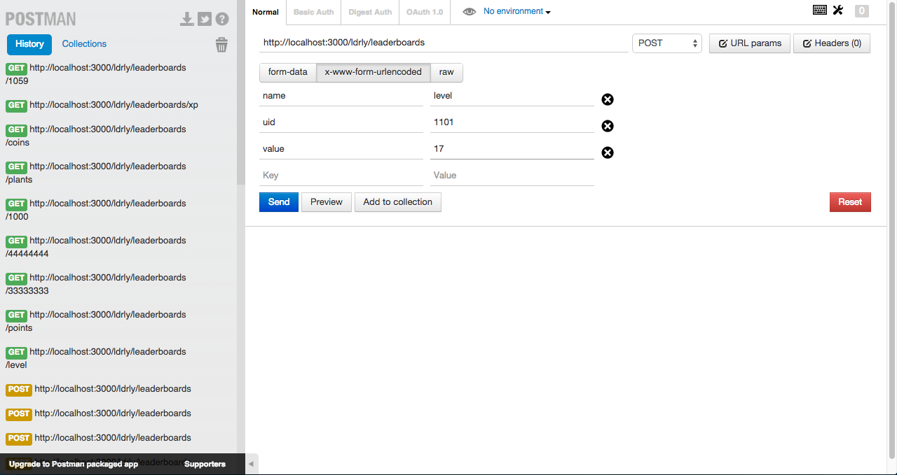

# TechTest

This project was the tech test for my LDRLY interview.

In order to run this properly, you will need:
    Express version 4.12.1
    Mongoose version 3.8.25
    Body-Parser version 1.12.1
All of these are defined in the package.json file so all that needs to install the dependencies,

	npm install

start the server, 

	node server.js

and find a way to send requests and receive responses. For this, I used Postman. You can find it <a href="https://chrome.google.com/webstore/detail/postman-rest-client/fdmmgilgnpjigdojojpjoooidkmcomcm?hl=en">here</a>.

An example of the URI to which the get request would be made is:

	http://localhost:3000/ldrly/leaderboards/1059

where 1059 is the user id. This gets all the stats for user 1059. 
You can get the leaderboards by calling:

	http://localhost:3000/ldrly/leaderboards/coins

where coins is a stat. 
To add a stat, you can call POST with:

	http://localhost:3000/ldrly/leaderboards

where the body of the request should be urlencoded and look something like this:

	key: name    value: level
	key: uid     value: 1101
	key: value   value: 17
	
This would is also a good suggestion for a POST request test due to how the model was defined (refer to assumption 1.). In Postman, the request build would look something like this:

It should be noted that possible values for stat names are as follows:
kills, 
points, 
level, 
missions_complete, 
xp, 
objects_collected, 
diamonds, 
coins, 
acres_owned, 
plants

The users that already exist are users with usernames between 1000 to 1100.

The database has been populated, the code is here on github, and hopefully you can use Postman to view the results of the requests. If you would like access to the database, please let me know. 

I have over-simplified this, but I thought it was best to keep it as simple as possible in this context. Had this been an actual system expected to go live, I would have changed many things about 

I have listed the assumptions I made because I didn't want to fill up your inbox with tons of emails asking you to clarify. I hope that is okay. 

# Assumptions:

1) The stat model defined was created with the intent that it would be used for one and only one game. This implies that the stat names are unique and the user ids are unique. As a result of this assumption, the model is very simple, and neither the user id or the stat name is defined to be unique.

2) I assumed that the terms username and user id were interchangeable, so in this model, uid refers to a user name and vice versa. This was to simplify the stat model.

3) I used Mongoose because it is a more heavy duty driver, has built in validation, and works for larger systems. I wanted to have experience with this driver because I thought it would be more useful.

4) In the description of the test, you define getLeaderboard as a function that gets a "JSON sorted list of all recorded users with entires for the specified stat (highest to lowerest) of the username, users ranking, and points scored". I understood this as follows:
	a) return a JSON array
	b) of stats with uid, points scored, and ranking
	c) where the ranking is added to the JSON objects after the query and not persisted in the database
	d) and if there are users that have the same value for the same stats, then both users will have the same rank. For instance, if I am user 1002 and I'm on level 46 and user 1059 is also on level 46, then we will have the same rank.

